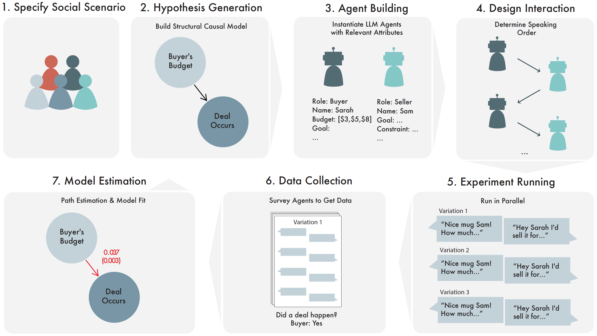

# Automated Social Science: Automated Social Science: Language Models as Scientist and Subjects
[](https://opensource.org/licenses/MIT)

## Table of Contents
1. [Overview](#overview)
2. [Disclaimers](#disclaimers-please-read-before-using)
3. [Social Scenarios](#what-is-a-social-scenario)
4. [How to use](#getting-started)
5. [Outputs](#output-structure)
6. [Examples](#example-to-play)
7. [Code Architecture](#repository-architecture)


## Overview
This is the code for: https://arxiv.org/abs/2404.11794.
<p align="center">
  
</p>

If you make use of this code in any formal way, we would appreciate a citation:

```
@article{manning2024automated,
  title={Automated Social Science: Language Models as Scientist and Subjects},
  author={Manning, Benjamin S and Zhu, Kehang and Horton, John J},
  institution = "National Bureau of Economic Research",
  type = "Working Paper",
  year={2024}
  url"https://www.nber.org/papers/w32381",
}
```

If you are interested in knowing more about and exciting research field of LLMs and social science, there is a repo tracking the recent literature in this field: https://github.com/KeHang-Zhu/Awesome-LLM-for-Social-Science

## Disclaimers--Please Read Before Using

- It is highly recommended that readers at least skim the paper prior to engaging with these instructions
- While we have made efforts to ensure the robustness of the code system, it is not infallible and may occasionally generate unexpected errors. Our primary goal is to share our methodology and provide clarity on the process outlined in the paper.
- In the event that you encounter issues, please create an issue, and we will try to assist you or, at the very least, provide an explanation for the system's shortcomings.
- Running the entire process from end-to-end can be a time-consuming, potentially taking up to three hours, as exemplified by the auction simulations in the original paper.
- It is crucial to note that the process can incur substantial costs, potentially amounting to **several hundred dollars**. Please exercise caution before initiating numerous in silica simulations if you do not have sufficient funds in your OpenAI account that you are willing to allocate.

Some potential system failures that we expect some people to run into that we cannot preemptively solve are:

- OpenAI Rate-Limit Errors: Extensive rate limiting has been implemented within the system; however, depending on the specific account details, the system may experience stalling.
- Lack of Outcome Variation: If the experiment fails to induce variation in the outcome, the system will be unable to estimate a Structural Causal Model (SCM). For instance, in a scenario involving two individuals engaged in bargaining, if they never reach an agreement, Lavaan, the package utilized for estimation, will generate an error unless all variables have a variance greater than zero. Fundamentally, this signifies that the experiment has failed, as the causes did not influence the outcome. Even in such cases, the system will still generate a `data.csv` file, which will reveal that the outcome had zero variance.
- Conditional Outcome Never Occurs: A related issue may arise if the outcome is conditional and never materializes. In the bargaining scenario, if the outcome is defined as the final price of a deal, and no deal is reached, the same error will occur as described in the previous point.
- Suboptimal LLM-Generated SCM: The LLM)generating the SCM may occasionally provide an inadequate response. Although numerous checks have been integrated into the system to mitigate this, if the temperature of the "scientist" portion of the system exceeds zero, this issue may sporadically occur, and there is no perfect method to verify every possible natural language edge case.
- System Execution Success Rate: Based on our experience, the system successfully executes an experiment without encountering an error approximately 70% of the time. In most cases, rerunning the process should resolve the majority of issues.

<!-- - PyPI: ... -->
<!-- - Documentation:  -->
<!-- - Discord: ... -->

## What is a social scenario?

A scenario is a simple natural language sentence describing multiple people interacting. The system takes in one scenario to "explore" in it's process. Here are the scenarios we use in the paper:

- Two people bargaining over a mug
- A judge is setting bail for a criminal defendant who committed 50,000 dollars in tax fraud.
- A person interviewing for a job as a lawyer.
- 3 bidders participating in an auction for a piece of art starting at fifty dollars.

### Important features of input scenarios

To increase the likelihood of success for your social scenarios, it is advisable to adhere to the following guidelines. While none of these features is strictly mandatory, our experience in simulating these experiments suggests that your ideas will have a significantly higher probability of successful execution if you comply with these token rules:

- Social scenarios should generally make reference to a minimum of two individuals. The system consistently attempts to generate two or more agents for the simulations; therefore, if your scenario does not implicitly refer to at least two people, it may not function as intended. For example, "a person playing solitaire in her room alone while crying" would not be considered an appropriate "social" scenario.

- Employing social scenarios similar to those in the paper is generally effective. Certain features that align well with the system, as demonstrated in our examples, include:
  - Clear identification of the agents who will participate in the simulations.
  - Easily quantifiable outcomes and causes.
- **IMPORTANT**: The social scenario should revolve around a topic that can be accomplished solely through the exchange of text. If the scenario involves "3 people building a tower" and the outcome is "whether the tower was built," there is a risk that the tower may never be constructed since, at present, Language Models (LLMs) do not possess the capability to physically build towers.

## Getting started

### How to install:
Our package is compatible with Python 3.9 - 3.11.

- Start with creating a virtual environment and install the required packages
```
python -m venv myvenv
source myvenv/bin/activate
pip install -r requirements.txt
```
- You need to have a .env file that contains your openai API key
```
touch .env
nano .env
```
In the text editor，replace the  ... with your actual OpenAI API key：
```
OPENAI_API_KEY = ...
```

### How to run the code:
- If you would like to try running the entire system from start to finish, only inputting a scenario of interest, you can use the following command:
```
python -m src end-to-end "scenario you are interested in" --n-causes N_causes
```

- If you would like to have the system generate a hypothesis and run an experiment, you can run the following. Then, follow the instructions in the command line and keep adding information when prompted. Often times, you may be asked to copy and paste information to proceed to the next step; we have added this feature so it is easier to follow and debug.
```
python -m src build-scm "scenario you are interested in"
```

- If you already have a JSON file for the Structural causal model that you have saved and would like to test, you can run the following:
```
python -m src run-experiment-with-scm "path/to/your/scm.json"
```

- If you want to add a new cause for an existing SCM (we only allow for one outcome node for now), you can use `build-cause-with-scm` to build the TARGET_CAUSE :
```
python -m src  build-cause-with-scm TARGET_CAUSE SCM_PATH
```
- If you want to delete a TARGET_CAUSE a, you can use the `delete-line` function.
```
python -m src  delete-cause TARGET_CAUSE TARGET_OUTCOME SCM_PATH 
```

- If you want to do data analysis with an existing `result_{scenario}.json` file, you can use the `analysis-data` function
```
python -m src analysis-data PATH-TO-YOUR-RESULT-JSON-FILE
```


### Optional Parameters
For the `end-to-end` and `run-experiment-with-scm`, we offer some optional parameters for the user to choose from. Raising the number of causes above 3 or the number of max iterations above 20 can dramatically increase the time it takes to run the process and the cost in OpenAI API calls.
1. `--n-causes`: number of causes to include in proposed SCM [default: 2]
2. `--mode`: the mode for running the experiment, either 'sequential' or 'parallel'.  [default: 'sequential']=
3. `--max-interactions`: maximum number of interactions for a single simulation [default: 20]
4. `--temp-scientist`: the temperature for hypothesis generation [default: 0.4]
5. `--temp-subject`: the temperature for the LLM agents to make decisions [default: 0.3]
6. `--subsample` / `--no-subsample`: Do full combinatorial simulation or subsampling.  [default: no subsample]
7. `--sample-proportion`: if you choose `--subsample` mode, you can set the subsampling proportion, 1 is full combination. [default: 1]

The detailed commands with optional parameters are listed below:
```
python -m src end-to-end "scenario-you-are-interested-in" --n-causes N_causes --mode "sequential" --max-interactions 20
python -m src run-experiment-with-scm "path/to/your/scm.json" --mode "parallel" --max-interactions 10
```

### How to get help:
- You can always run the help command to see all the functions
```
python -m src --help 
```
- Or if you want to know in detail how to use a command
```
python -m src `command` --help 
```
## Output Structure
By default, all output files are saved in the `experiment_logs/` directory. **It is important to delete this directory before each new experiment. Otherwise, the files might conflict. We recommend moving the files somewhere else for future use.** When running the commands, several different types of files are produced, detailed as follows:

1. **Structural Causal Models (SCM) Files**:
   - `scm_outcome_{scenario}.json`: Contains only the SCM only consists outcomes.
   - `scm_{scenario}.json`: Contains both outcomes and causes of the SCM.

2. **Agent Information Files**:
   - `agent_{scenario}.json`: Stores information related to the Large Language Model (LLM) agent, including the basic attributes, interaction type and order and the variations.

3. **Interaction History Files**:
   - `history_{scenario}.json`: Records all the interaction histories between agents, stored sequentially for each variation of the causes.

4. **Result Files from Interactions**:
   - `raw_result_{scenario}.json`: Contains all data including SCMs, agents, interaction histories, and measurement results as a dict.
   - `result_{scenario}.json`: Classifies and organizes the data by each variation of the causes, making it easier to analyze specific aspects of the results.

The following two sets of files (5. and 6.) will be stored in a subdirectory `analysis__{date_time}/` with the exact date-time the analysis was executed so they can be easily referenced. Each time time a data analysis is executed, a new subdirectory will be generated with these files.

5. **Result Files from Data Cleaning**:
   - `raw_data.csv`: Raw data from the experiments, still in string form. Each column in the .csv corresponds to one variable.
   - `meta_data.json`: Meta data for the raw data. Describes the type of each variable, the possible values it can take on, and a dictionary with the structure of the SCM
   - `scm_simple.json`: A cleaned up version of `scm_{scenario}.json`. 
   - `final_edge_dict.json`: A dictionary of the SCM structure removed from `meta_data.json` into its own file
   - `data.csv`: Cleaned data frame ready for analysis. Automatically includes columns for interaction variables.
   - `mapped_data.csv`: Copy of `data.csv` with shortened names for the variables to make visualization easier.
   - `final_mapping.json`: Dictionary mapping the column names between `data.csv` and `mapped_data.csv`

6. **Result Files from Data Cleaning**:
   - `{scenario}_scm.tex`: A latex file containing an automatically generated SCM in a pretty format the can be rendered to view the results.
   - `{scenario}_table.tex`:  A latex file containing an automatically generated table decsribing the experiment in a pretty format the can be rendered to view the results.
   - `estimates_df.csv`: The output from estimating the SCM directly generated in R using `lavaan`.

Each file is named according to the scenario it pertains to, ensuring organized and accessible output for further analysis.

## Example to play
- We have prepared some example structural causal models, the four from the paper, if you would like to rerun the simulated conversations.
```
python -m src run-experiment-with-scm "src/Example/3 bidders participating in an auction for a piece of art starting at fifty dollars.json"
``` 
```
python -m src run-experiment-with-scm "src/Example/a judge is setting bail for a criminal defendant who committed 50,000 dollars in tax fraud.json.json"
``` 
```
python -m src run-experiment-with-scm "src/Example/lawyer_interview_3var.json"
``` 
```
python -m src run-experiment-with-scm "src/Example/two people bargaining over a mug.json"
```


## Repository Architecture

This repository is organized to contain the source files of the entire package within the `src` directory. 

If you do not want to run any of the code but are just interested in exploring what we did, we suggest checking out the `end_to_end()` function in `cli.py`. This function simulates the entire process given a scenario description. If you read through the parts of the function throughout the repo, you can see how we organized the process. We also suggest looking at the text files in any directory labeled `\prompt_templates` as these are the prompts we used to make the system work.


Here's an overview of the structure and key components:

## `src` Directory
This package utilizes the Typer command-line interface framework for its operations.

- **`cli.py`**: This file contains the backend functionalities of the package. It houses the core logic that the command-line interface interacts with

- **`utils.py`**: helper functions

- **`__main__.py`**: entry point script


The `src` directory houses all modules supporting the functions. Within this directory, you'll find the following organizations:

### 1. `Human` Module---LLM as subjects

This module is designed to handle aspects related to agents within the system. Mainly representing the agents as independent LLMs and coordinating their interactions. One can think of this module as being relevant to the middle of the system's process, i.e., steps 5 and 6 in the figure at the top of this page.

- **Human.py**: Responsible for instantiating an agent. This script includes the class definitions and necessary functions to create and manage an agent within the system. We discuss generating agents in Section **A.2** of the paper and steps 5 and 6 in the figure at the top of this page.
  
- **Interaction.py**: Contains the various types of interactions that can occur. This file defines different interaction classes or methods that agents can use to interact within the system. We discuss determining how agents interact in Section **A.3** of the paper and steps 5 and 6.

- **prompt_templates**: Contains relevant prompts.

### 2. `JudeaPearl` Module---LLM as a scientist (and subject designer)

This module helps organize the beginning and end of the system's process, i.e., steps 1,2,3,4, and 7 in the figure at the top of this page. 

- **StructuralCausalModelBuilder.py**: This is tasked with setting up variables according to a given scenario description. It stores and manages various properties of the scenario, including the scenario description, the list of agents involved, and maintains multiple dictionaries to keep track of variables, edges, and untracked paths.

- **JudeaPeal.py**: This queries the LLM to get outcomes of interests and the relevant agents for the scenario. Relevant to section **A.1** in the paper and steps 1, 2 in the figure at the top of the page.

- **Variable.py**: Defines Variables and all of the attributes, both exogenous and endogenous. Relevant to section **A.1** and step 2.

- **VariableBuilder.py**: Builds variables. Relevant to section **A.1** and step 2

- **AgentBuilder.py**: Generates agents and selects the interaction protocol. Relevant to sections **A.2** and **A.3** and steps 3 and 4.

- **DataParser.py**: Gets the raw outcomes and causes to be cleaned from the conversation transcript. Relevant to section **A.3** and step 6.

- **DataCleaner.py**: Cleans the data, making everything into floats and ints. Relevant to section **A.3** and step 6.

- **DataAnalyst.py**: Builds the visualizations and lavaan strings for estimation. Relevant to section **A.4** and step 7.

- **estimate_sem.R**: Estimates the paths using Lavaan. Relevant to section **A.4** and step 7.

- **prompt_templates**: Contains relevant prompts.

### 3. `LLM` Module

This module is designed to invoke different Large Language Models (LLM) methods. This module facilitates the integration and utilization of various LLMs and their settings based on the package's needs.

### 4. `Question` Module

This module is designed to call different prompt methods. It includes functions and methods for designing and executing prompts that interact with the underlying models or data structures.

### 5. `Serialization` Module

This module is designed to convert intermediate results into JSONs. It ensures that data can be stored, shared, or further processing in a standardized way.

### 6. `Example` Module

Contains several pre-built SCM (Structural Causal Model) JSON files. These files serve as examples for building your own structural causal models using the framework provided in this repository.

---

## 🔧 Dependencies
The main third-party package requirement is `openai`.

## 💡 Contributing, Feature Asks, and Bugs
Interested collaborating in LLM as scientist and subjects? Found a nasty bug that you would like us to squash? Please send us an email at kehangzhu@gmail.com.
